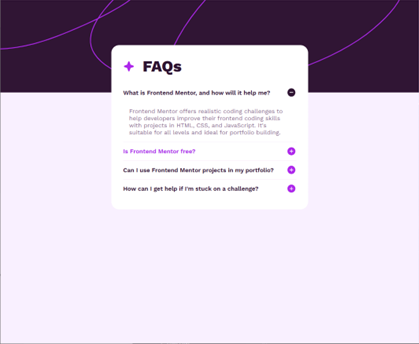
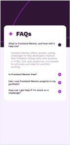

# Frontend Mentor - FAQ accordion solution

This is my solution to the [FAQ accordion challenge on Frontend Mentor](https://www.frontendmentor.io/challenges/faq-accordion-wyfFdeBwBz). 

## Overview

### The challenge

You should be able to:

- Hide/Show the answer to a question when the question is clicked
- Hide/Show the answer to a question when the item is focused and you click Enter key.
- The app should scale with the device's screen size.

### Screenshot

### Links

- Solution URL: [Github](https://github.com/toshirokubota/faq-accordion)
- Live Site URL: [Github page](https://toshirokubota.github.io/faq-accordion/)

## My process

### Built with

- Semantic HTML5 markup
- CSS custom properties
- Flexbox
- Box model

**Note: These are just examples. Delete this note and replace the list above with your own choices**

### What I learned

I l learned how to implement callbacks for mouse click and keydown, and use them
to implement the accordion pattern.

I used Flexbox to aligh elements (text and icon) vertically.

### Continued development

I want to learn more about the Flexbox model and Grid model. 

I also want to be more familiar with the DOM model and how to select DOM elements 
in javascript.
